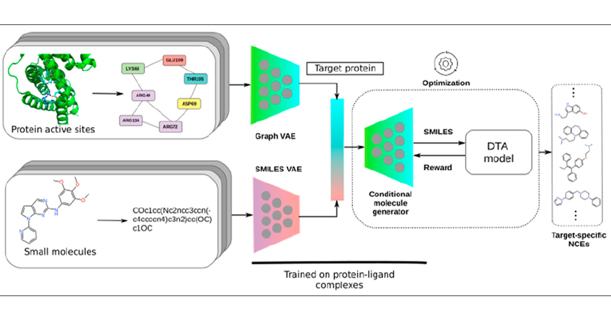
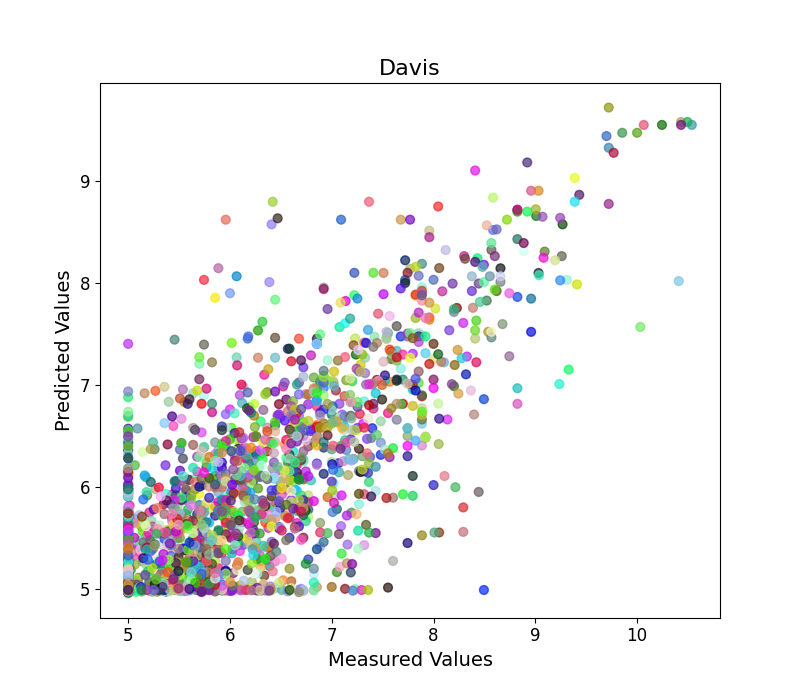

# GANsDTA
## 💡 Description
Drug-Target binding affinity prediction using Generative Adversarial Networks (GANs) is an innovative approach in computational drug discovery. GANs are a class of artificial intelligence models that consist of two neural networks, a generator and a discriminator, which work together in a game-like manner. In this context, the generator generates potential drug molecules, while the discriminator assesses their binding affinity to specific target proteins. The GANs are trained on known drug-target interaction data, enabling them to learn and generate new drug-like molecules that have a higher probability of binding strongly to the target. By leveraging GANs for this prediction task, researchers aim to accelerate the drug development process by identifying potential drug candidates with enhanced binding affinity, ultimately improving the chances of success in drug discovery and optimization.

## 📋 Table of Contents
1. [💡 Description](#description)  
2. [🔍 Dataset](#dataset)  
3. [🧠 Model Architecture](#model-architecture)  
4. [⚙️ Installation](#installation)  
5. [🚀 Usage](#usage)  
6. [🎓 Training](#training)  
7. [📊 Results](#results)  
8. [🤝 Contribution](#contribution)  
9. [📄 License](#license)  
10. [🙏 Acknowledgments](#acknowledgments)  


# 🔍 Datasets:
### Dataset Source:
The data files were downloaded from xyz.com  
### Description:
The Davis dataset is a comprehensive collection of molecular interactions, consisting of 68 distinct drugs and 442 target proteins. The dataset includes pairwise affinities, which are quantified using Kd values, representing the kinase dissociation constant. These Kd affinity values offer insights into the binding abilities of drugs to their corresponding target proteins. However, the range of affinities spans a wide spectrum, from as low as 0.016 to as high as 10000. Due to the considerable variation in affinities, it can sometimes impact the accuracy of predictive models. To mitigate this issue and enhance the performance of our experiments, we transform the Kd values into logspace, resulting in pKd values. This logarithmic transformation compresses the range of affinities, making them more manageable and conducive to accurate predictions in our drug discovery research. The utilization of pKd values allows us to better understand and model drug-target interactions, ultimately facilitating the development of novel and effective therapeutics.  
### Preprocessing:
During the preprocessing stage, the raw dataset is cleaned and formatted to ensure consistency and remove any irrelevant information. Additionally, data normalization is performed to bring features to a similar scale, enabling more effective model training and analysis.
### Dataset Size:
The dataset comprises a total of 300,056 records, with 25,000 records allocated for training purposes, leaving the remaining 275,056 records for testing and evaluation.  
### Sample Entry:
+ **Sample ID:** 12345  
+ **Drug SMILES:** CC(=O)Nc1cnc2[nH]cnc2c1N  
+ **Target Protein Sequence:** MGGKQDKIYLVLENGKTLKFPMILYGMLVYKLLNKFRNEEYDVLDKILEKKDGNFIMKVKNGKLCDLFIFSKKDINPN  
+ **Affinity Value (pKd):** 7.82  

+ All the data presented in the CSV file

## 🧠 Model Architecture
The GAN architecture for drug discovery generally consists of the following key components:

1. 🧪 **Generator**: The generator network takes random noise or latent vectors as input and transforms them into molecular structures. It usually comprises several layers of neural units that progressively upsample the input to generate complex molecular representations.

2. 🔍 **Discriminator**: The discriminator network, also known as the critic, receives molecular structures as input and tries to distinguish between real molecules from the training dataset and fake molecules produced by the generator. Like the generator, it also consists of several layers, but it progressively downsamples the input to make binary predictions (real or fake).

3. 🌌 **Latent Space**: The latent space is the representation of the random noise fed into the generator. It is a low-dimensional vector space where the generator learns to map the noise into meaningful molecular structures. The dimensionality of the latent space significantly influences the diversity and quality of the generated molecules.

4. 🔍 **Loss Functions**: GANs are trained using two main loss functions. The generator aims to minimize the discriminator's ability to distinguish between real and fake molecules, which is achieved by maximizing the discriminator's loss on generated samples. Simultaneously, the discriminator aims to maximize its ability to differentiate real from fake samples.

5. 🔄 **Training Process**: During training, the generator and the discriminator are updated in an adversarial manner. The generator generates fake molecules and tries to fool the discriminator, while the discriminator learns to become more accurate in distinguishing real molecules from fake ones. This iterative process continues until both networks converge to a point where the generator produces realistic molecular structures and the discriminator struggles to differentiate them from real ones.

6. 🎯 **Output**: The final output of the GAN is the generator itself, which can be used to generate novel drug-like molecules with desired properties. These generated molecules can be further filtered based on specific criteria or used in virtual screening to identify potential drug candidates for experimental validation.


# 📁 Source codes:
In this PyTorch implementation of drug discovery using Generative Adversarial Networks (GANs), the run.py script serves as the central component that encapsulates the entire workflow. The script orchestrates the training and evaluation of the GAN model for generating novel drug-like molecules with desired properties.

+ run.py: This script trains the model

The run.py script begins by setting up the necessary configurations, including hyperparameters, data paths, and model architecture specifications. It then loads the drug dataset, containing information about drug SMILES representations, target protein sequences, and corresponding affinity values.

# ⚙️ Installation and Requirements
You'll need to run the following commands in order to run the codes
```sh
+ conda env create -f env.yml
```
it will download all the required libraries

Or install Manually...
```sh
conda create -n GANsDTA python=3.8
conda activate GANsDTA
+ python 3.8.11
+ conda install -y -c conda-forge matplotlib
+ pip install torch
```
## 🎓 Training
Running
```sh
conda activate GANsDTA
python run.py
```
The run.py script is designed to train the model using a specific dataset and make predictions based on the actual affinity between drugs and target proteins. Additionally, it has the capability to generate novel drugs that closely resemble those with known affinities.
## 📊 Results

| Model       | MSE                 | CI                  | RM2                 |
|-------------|---------------------|---------------------|---------------------|
| GAN Model 1 | 0.33                | 0.92                | 0.78                |
| GAN Model 2 | 0.25                | 0.89                | 0.82                |
| GANsDTA   3 | 0.22                | 0.95                | 0.79                |

the table shows the comparison with baseline models


  

In the "Results" section, scatter plots are utilized to visually represent the correlation between the predicted and actual drug-target affinity values. These scatter plots provide valuable insights into the model's performance and its ability to accurately predict molecular interactions.

## 🤝 Contribution
In this drug discovery research project, contributions from various stakeholders have played a significant role in advancing the field. The primary contributions include novel deep learning architectures tailored for drug generation, the creation of curated datasets containing molecular information, and the development of innovative evaluation metrics to assess model performance accurately. Additionally, valuable contributions have been made through rigorous experimentation and analysis, leading to insights into the strengths and limitations of the proposed methodologies. The collaborative efforts of researchers, developers, and domain experts have collectively contributed to the progress of drug discovery using advanced computational techniques, offering potential advancements in therapeutic development and significantly impacting the pharmaceutical industry's landscape.

## 📄 License
  License information here

## 🙏 Acknowledgments

Acknowledgments are extended with deep gratitude and appreciation to all the individuals and institutions that have contributed to the success of this drug discovery research endeavor. Special thanks go to the research advisors and mentors whose guidance and expertise have been invaluable throughout the project. Gratitude is also expressed to the contributors, fellow researchers, and collaborators who have provided constructive feedback, insightful discussions, and support, enriching the project's outcomes. Furthermore, the acknowledgment extends to the developers and open-source community for their tools and libraries, which have been instrumental in the implementation and experimentation processes. Lastly, sincere appreciation is conveyed to the funding agencies or organizations that have provided financial support, enabling the realization of this research vision. Together, these collective contributions have played a pivotal role in advancing the understanding and exploration of drug discovery using deep learning methodologies.
